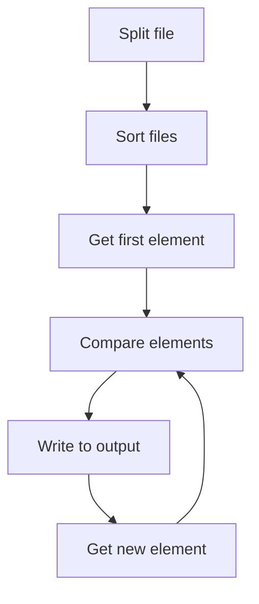

# Merge sort
### Wait is the problem?
The idea is ordering a big file with `N` GB size, but it is not possible to load this file in RAM memory, for example
50 GB file, in a machine with 32 GB.

### High level soluction
The idea is to split the large file into smaller files, sort each of these smaller files, and then process them 
as follows: 
- load the first element from each file
- identify the smallest element among them
- write it to the output file,
- get a new item from the file that had the smallest element
- repeat until all files are empty



## first generator code timing
```sh
go run cmd/generator/main.go  12.75s user 3.07s system 130% cpu 12.119 total
➜  n-way-sort git:(main) ✗ time go run cmd/generator/main.go
go run cmd/generator/main.go  12.77s user 3.14s system 135% cpu 11.740 total
➜  n-way-sort git:(main) ✗ time go run cmd/generator/main.go
go run cmd/generator/main.go  12.74s user 3.08s system 135% cpu 11.679 total
➜  n-way-sort git:(main) ✗ time go run cmd/generator/main.go
```
## split file code timing
```sh
go build cmd/sorter/main.go  && time ./main --file-input input.txt --r-workers 2 --w-workers 2 --n-gb 2
./main --file-input input.txt --r-workers 2 --w-workers 2 --n-gb 2  0.54s user 11.13s system 45% cpu 25.747 total
```

## sort file code timing
```sh
// GB: 100
./main --file-input input.txt --n-gb 2  102.71s user 313.73s system 135% cpu 5:07.26 total
// GB: 75
./main --file-input input.txt --n-gb 3  75.73s user 276.85s system 110% cpu 5:18.84 total
// GB: 50 
./main --file-input input.txt --n-gb 2  46.75s user 143.54s system 134% cpu 2:21.27 total
```

